## Part 1. Ready-made docker
* Take the official docker image from nginx and download it using docker pull.

* Run docker image with docker run -d [image_id|repository]
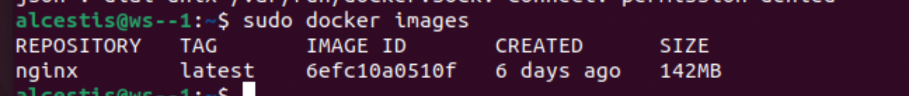

* Check that the image is running with docker ps

* View container information with docker inspect [container_id|container_name]

* From the command output define and write in the report the container size, list of mapped ports and container ip

* Stop docker image with docker stop [container_id|container_name]

* Check that the image has stopped with docker ps
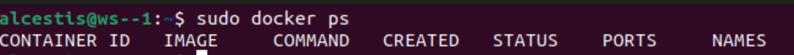
* Run docker with mapped ports 80 and 443 on the local machine with run command
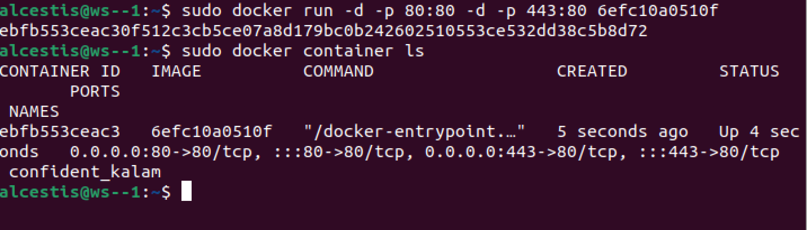
* Check that the nginx start page is available in the browser at localhost:80
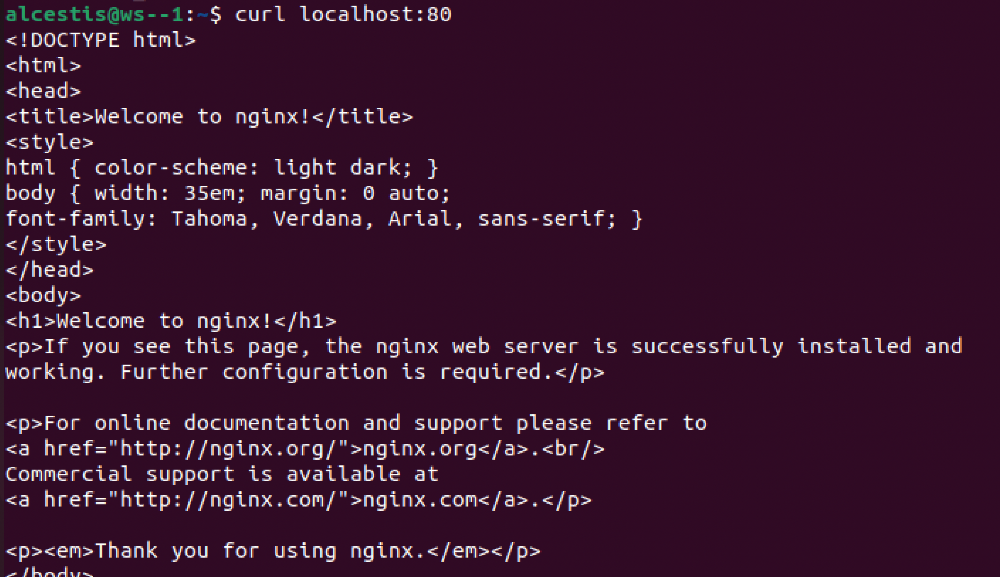
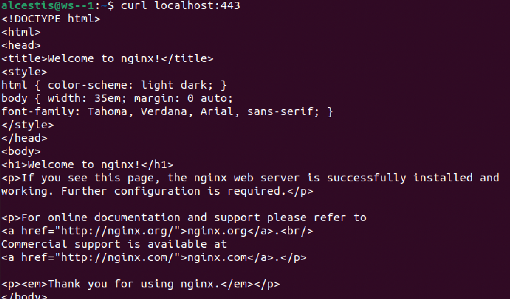
* Restart docker container with docker restart [container_id|container_name]
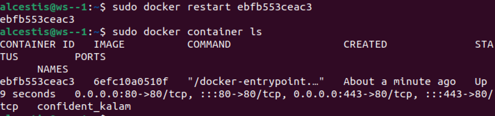
* Check in any way that the container is running

## Part 2. Operations with container

* Read the nginx.conf configuration file inside the docker container with the exec command
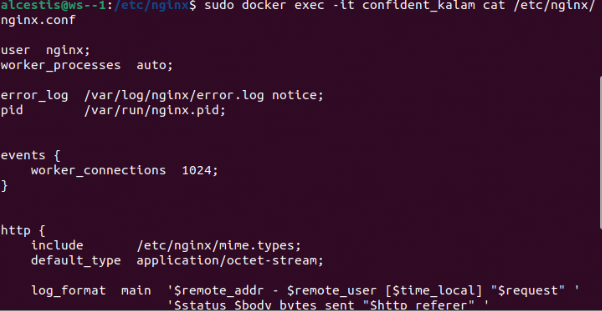
* Create a nginx.conf file on a local machine + Configure it on the /status path to return the nginx server status page

* Copy the created nginx.conf file inside the docker image using the docker cp command + Restart nginx inside the docker image with exec
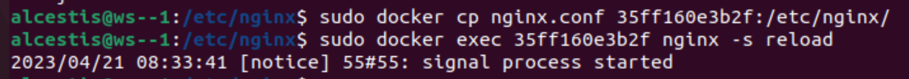
* Check that localhost:80/status returns the nginx server status page
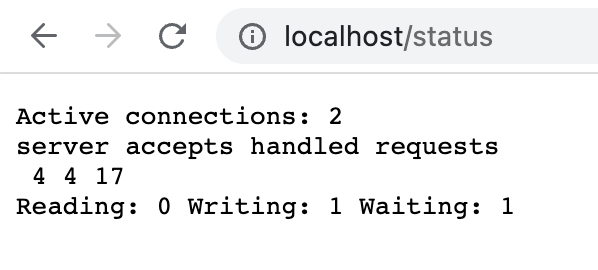
* Export the container to a container.tar file with the export command
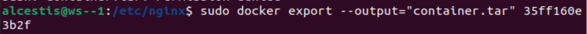
* Stop the container
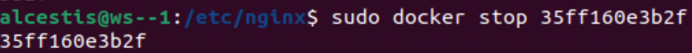
* Delete the image with docker rmi [image_id|repository]without removing the container first
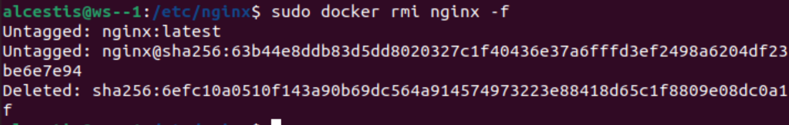
* Delete stopped container
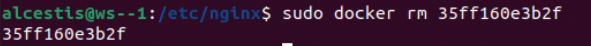
* Import the container back using the `import` command
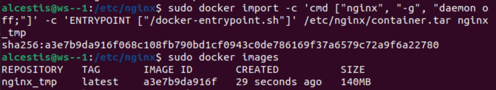
* Run the imported container
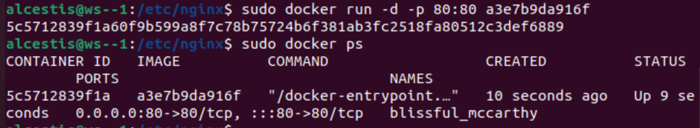
* Check that localhost:80/status returns the nginx server status page
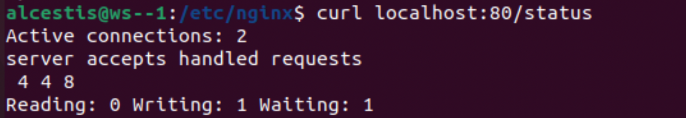

## Part 3. Mini web server
### Aim: Write a mini server in C and FastCgi that will return a simple page saying Hello World!

* Run container based on nginx image. Name of the container - `server`
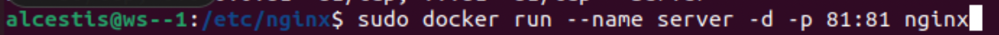
* Make worling directory `server` and update apt-get inside the container
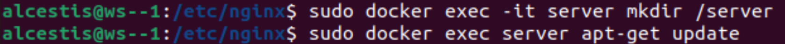
* Install spawn-fcgi and libfcgi-dev
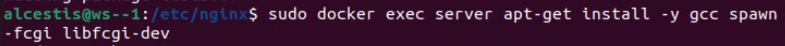
* Copying main.c and nginx.conf into out container
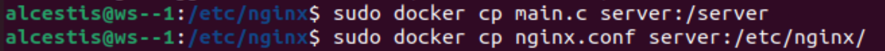
* Compile main.c
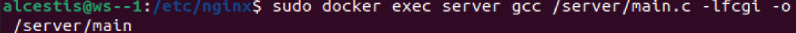
* Reload nginx
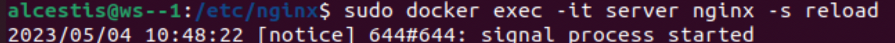
* ???
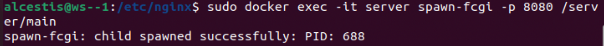
* Check localhost

## Part 4. Your own docker
* docker image that: 
    1) builds mini server sources on FastCgi from Part 3
    2) runs it on port 8080
    3) copies inside the image written ./nginx/nginx.conf
    4) runs nginx.
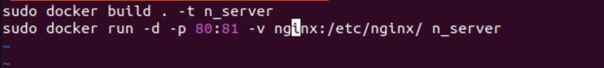
* Build the written docker image with docker build, specifying the name and tag
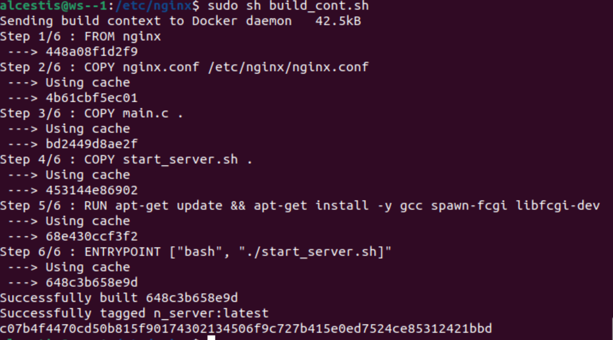
* Check that everything is built correctly
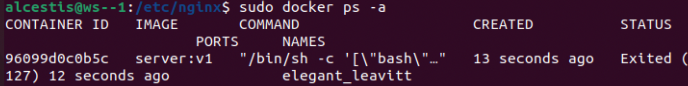
* Check that the page of the written mini server is available on localhost:80
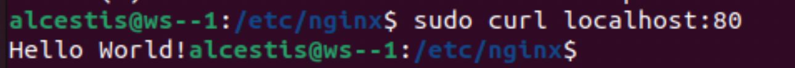
* Check that localhost:80/status now returns a page with nginx status

## Part 5. Dockle
* Install dockle
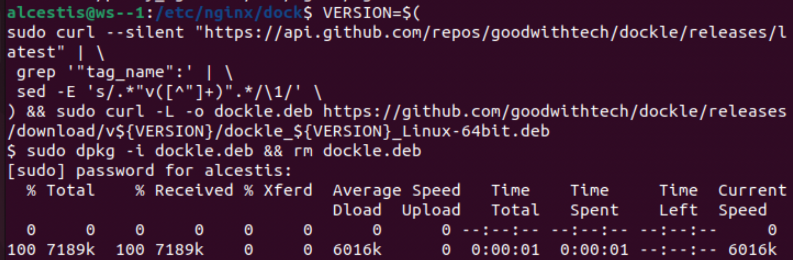
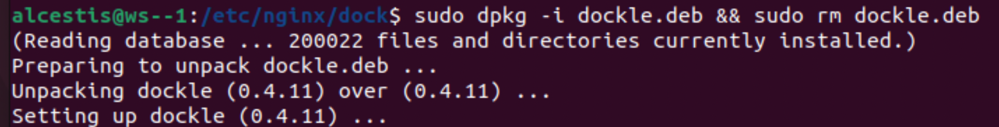
* Check the image from the previous task with dockle [image_id|repository]
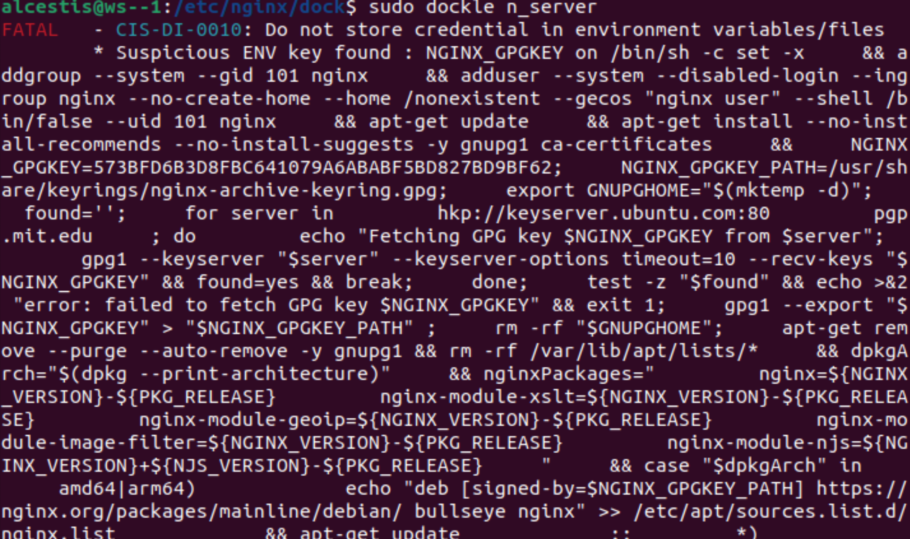
* Fix the image so that there are no errors or warnings when checking with dockle
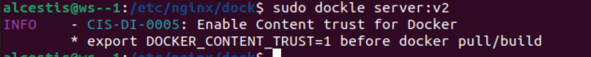

## Part 6. Basic Docker Compose

* Install docker-compose
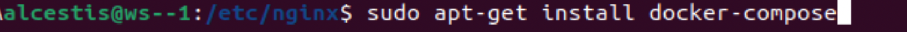

* Write a docker-compose.yml file, using which:
    1) Start the docker container from Part 5 (it must work on local network, i.e., you don't need to use EXPOSE instruction and map ports to local machine)

    2) Start the docker container with nginx which will proxy all requests from port 8080 to port 81 of the first container 
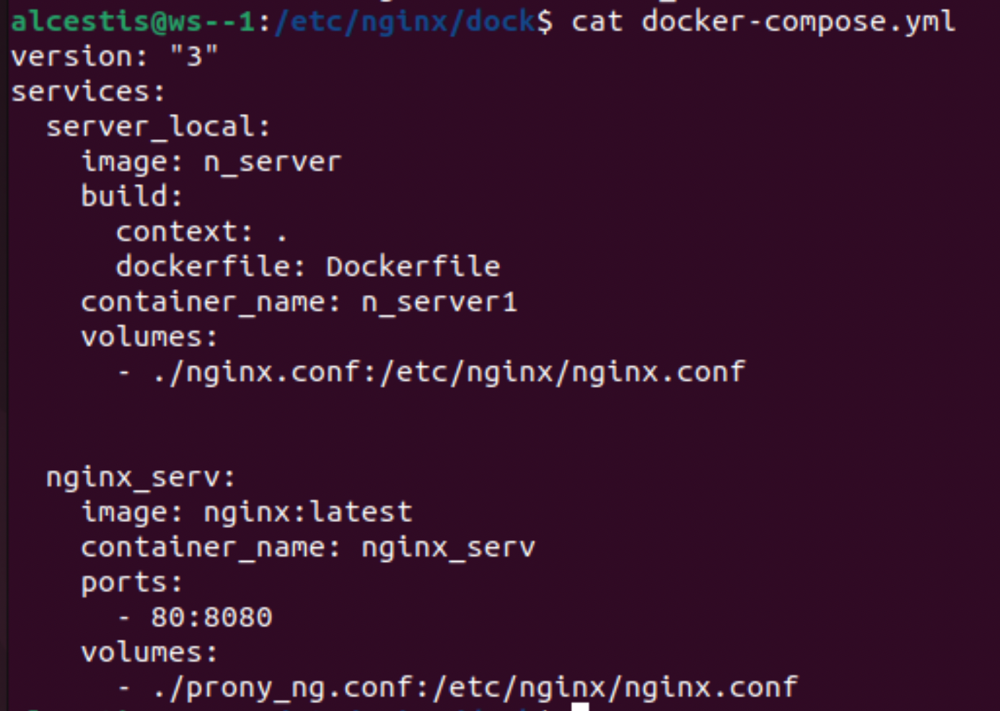
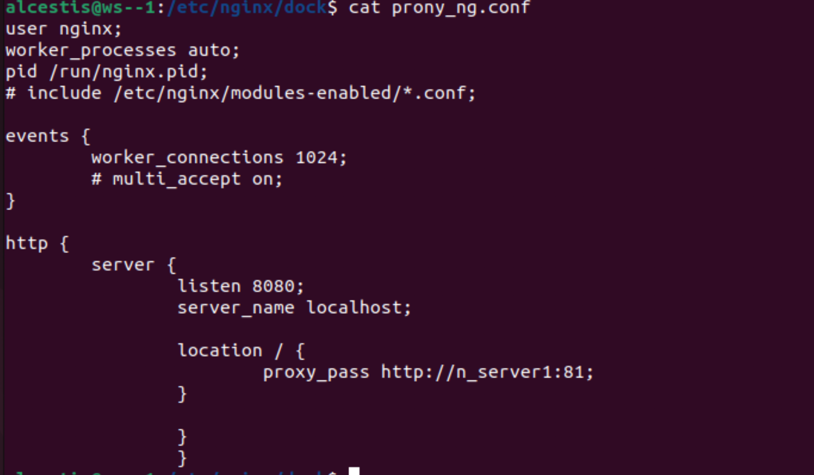
* Build and run the project with the docker-compose build and docker-compose up commands
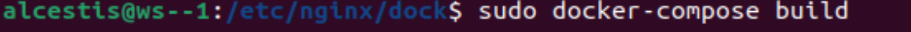
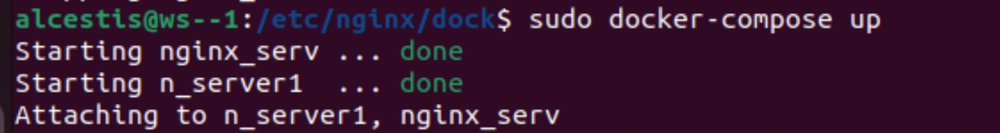
* Check that the browser returns the page you wrote on localhost:80 as before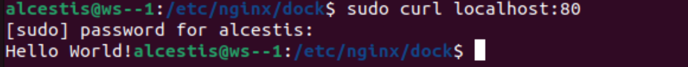